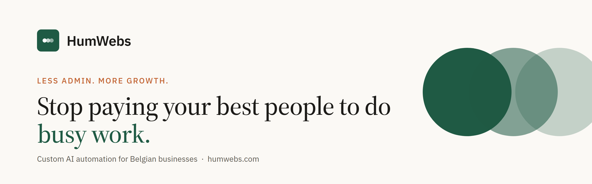

  

We take the repetitive work off a business's plate, so the team can focus on the work that grows the business.
Based in Belgium.

### What we build

Every solution is built around how the business already works. Nothing off the shelf.

| | |
|---|---|
| 💬 **Customer assistant** | Answers every call and email, and books meetings |
| 📚 **Team assistant** | Answers your team's questions from your own files, policies and order status |
| 🧾 **Instant quotes** | Quotes from your own prices and rules |
| 📊 **Reports that update themselves** | Your numbers, always current |
| 📄 **Paperwork filled in for you** | Documents and forms, done automatically |
| 🔁 **Follow-ups and invoice chasing** | Nobody slips through, no unpaid invoice forgotten |

### How it works

1. **Free 30-minute consultation.** We find where repetitive work costs you the most time and money.
2. **We design the solution for free** and show it to you on a short call.
3. **You only pay if you decide to put it to work.**

### Our rules

- **The assistant never guesses.** It checks your own data first, then asks when something is missing.
- The AI handles the conversation. **Prices and times are worked out by code** from your own price list and calendar.
- We work with you on scope. If something isn't a good fit for automation, we'll say so.

### Get in touch

🌐 [humwebs.com](https://humwebs.com) · ✉️ [info@humwebs.com](mailto:info@humwebs.com)
